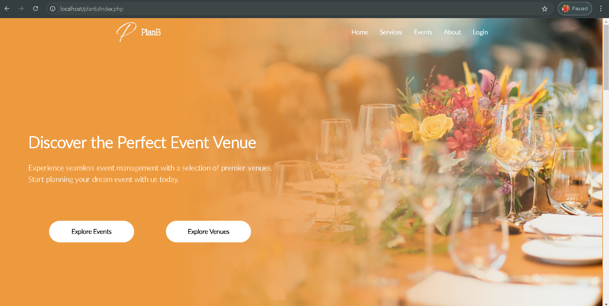
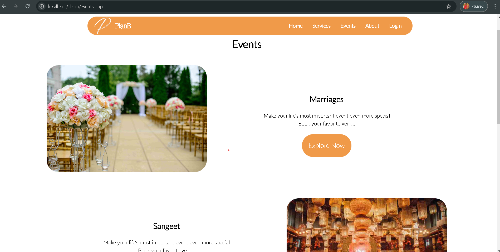
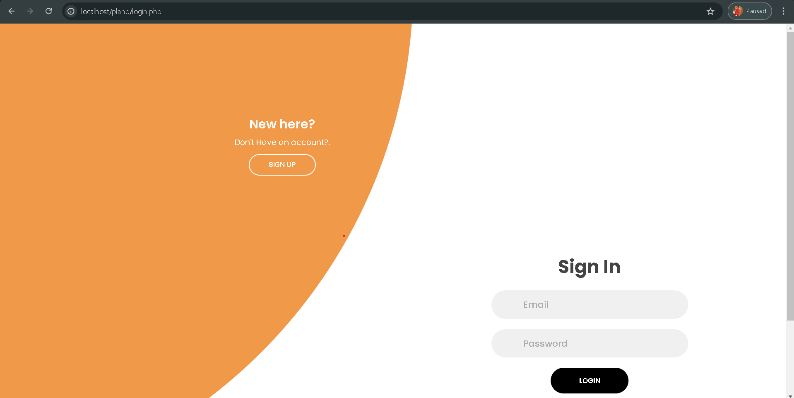

# Event planning website

## Description
This website gives you a user friendly navigation with an adoptable frontend. In this you can view, select and book the venues for any occassion. It gives you the feature of custom timings which you can select and make your bookings.
The user and booking detailed are stored securely in the mysql database. 

## Screenshots





## Installation

1. Clone the repository:
    ```bash
    git clone https://github.com/katkuriBalram/Event-planning-website.git
    ```
2. Navigate to the project directory:
    ```bash
    cd Event-planning-website
    ```
3. Make sure you have the prerequisites mentioned in requirements.txt

## How to execute

1. Add the folder of the project to the www folder of the wampser in your pc.
2. Start the server (in my case its wampserver) .
3. Open the phpmyadmin and login with your credentials.
4. Create the required databases with the Tables and required columns.
5. Adjust the paths and names of the databases,Tables and columns in the code.
6. Adjust the paths of the images. 
7. Open your browser and enter "localhost/yourfilename/index.php"

## Issues faced

- **Image Path Issues**: Ensuring the correct path. Absolute paths were used to avoid issues with relative paths.
- **Database Issues** : make sure the database name matches with the code and it consists of all the required tables having of teh required fields.
- **Data Type Issues** : make sure the fields consists of the compatible data type in the code and as well as the server


## connect me:
For any queries feel free to connect me at www.linkedin.com/in/katkuri-balram-143284248 or katkuribalram@gmail.com
